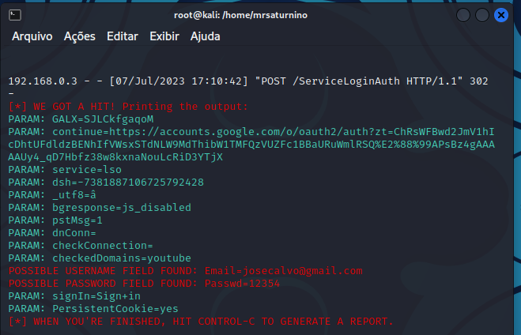

# Creating a basic Kali Linux phishing example

## using 'setoolkit' 

---

1. Install the setoolkit.
2. Switch to the root user and enter the 'setoolkit' command in the terminal.
3. Select the "(2) Website attack vectors" option.
4. Choose the (3) Credential harvester attack method.
5. Select either (1) Web Templates or (2) Clone Sites.
6. Enter an IP address for the POST back.
7. Choose your template.
8. Go to the address that you configured and enter some information for testing.
9. View the credentials in setoolkit terminal.

### Results example:

